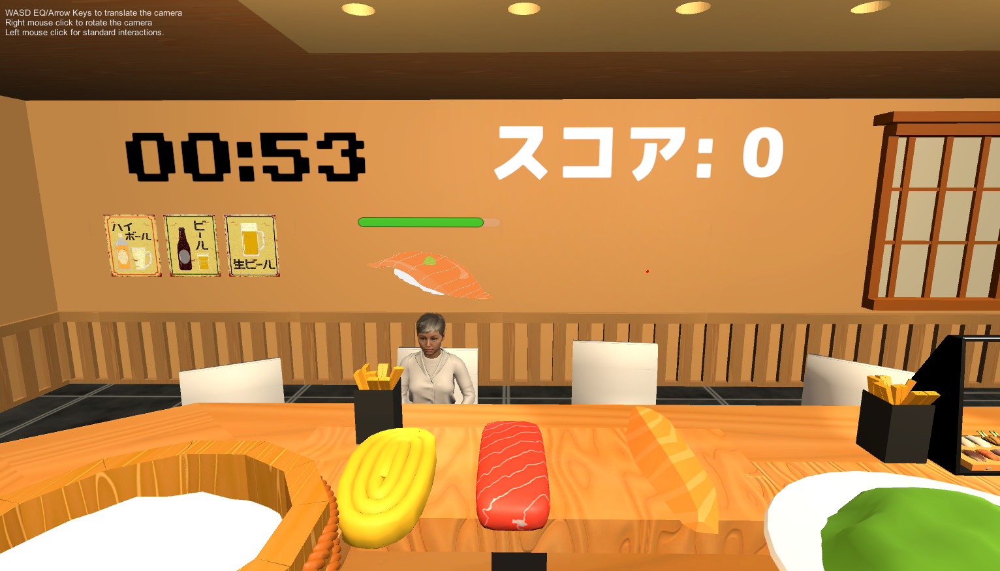

# VR寿司ゲーム

## 概要
VR空間で、来店した客の注文に応じて寿司を作り、投げて提供するゲームです。  
シャリとネタを両手でつかんで組み合わせ、完成した寿司を客に届けます。  
注文どおりに提供するとスコアを獲得でき、 
プレイを妨害する特殊な客も登場し、状況判断が求められるゲーム性を取り入れました。

## 開発期間
2025年11月〜2026年1月

## 開発体制
3人チーム開発

## 使用技術
- Unity
- C#
- XR Interaction Toolkit

## 担当部分
- 寿司の生成・投げるシステムの実装
- 注文UI・タイマーUIの実装
- 客の生成、座席管理、着席処理の実装
- 客アニメーションの制御
- スコアシステムの実装

## 工夫した点
- シャリとネタを両手でつかみ、組み合わせて寿司を作ることで、VRらしい直感的な操作を実現しました。
- 注文内容や残り時間を把握しやすいよう、UIの見やすさを意識して設計しました。
- 客が生成されてから席に移動し、着席するまでの流れを実装し、店舗らしい雰囲気を出しました。

## 課題と解決
### 課題
客が生成されてから空いている席へ移動し、自然に着席する流れを実装する必要がありました。

### 解決
スポナーと各座席の位置情報を整理し、空席を判定して適切な席へ移動させる仕組みを実装しました。  
さらに、移動から着席までの動作を連続的に制御することで、自然な流れを実現しました。

## スクリーンショット

## 動画
- [プレイ動画](https://www.youtube.com/xxxxx)

## 補足
実装内容だけでなく、VRらしい操作体験、UIの分かりやすさ、客の挙動の自然さを意識して制作しました。

[← ポートフォリオトップへ戻る](../README.md)